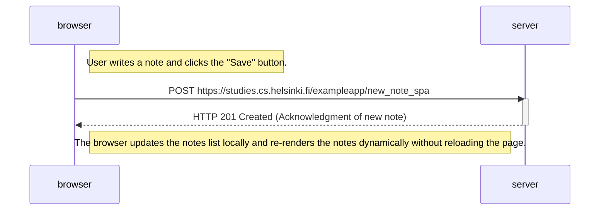

```mermaid

sequenceDiagram
    participant browser
    participant server

    Note right of browser: User writes a note and clicks the "Save" button.

    browser->>server: POST https://studies.cs.helsinki.fi/exampleapp/new_note_spa
    activate server
    server-->>browser: HTTP 201 Created (Acknowledgment of new note)
    deactivate server

    Note right of browser: The browser updates the notes list locally and re-renders the notes dynamically without reloading the page.


```