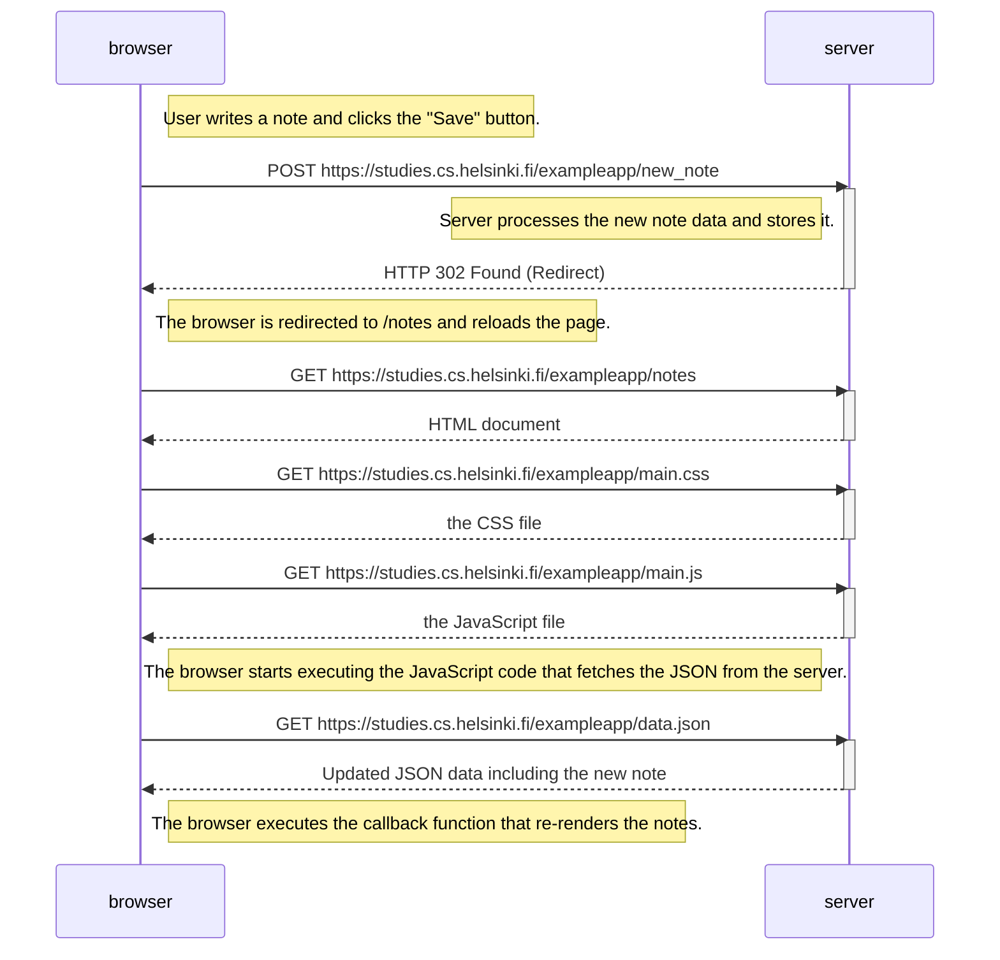

```mermaid

    sequenceDiagram
        participant browser
        participant server

        Note right of browser: User writes a note and clicks the "Save" button.

        browser->>server: POST https://studies.cs.helsinki.fi/exampleapp/new_note
        activate server
        Note left of server: Server processes the new note data and stores it.
        server-->>browser: HTTP 302 Found (Redirect)
        deactivate server

        Note right of browser: The browser is redirected to /notes and reloads the page.

        browser->>server: GET https://studies.cs.helsinki.fi/exampleapp/notes
        activate server
        server-->>browser: HTML document
        deactivate server

        browser->>server: GET https://studies.cs.helsinki.fi/exampleapp/main.css
        activate server
        server-->>browser: the CSS file
        deactivate server

        browser->>server: GET https://studies.cs.helsinki.fi/exampleapp/main.js
        activate server
        server-->>browser: the JavaScript file
        deactivate server

        Note right of browser: The browser starts executing the JavaScript code that fetches the JSON from the server.

        browser->>server: GET https://studies.cs.helsinki.fi/exampleapp/data.json
        activate server
        server-->>browser: Updated JSON data including the new note
        deactivate server

        Note right of browser: The browser executes the callback function that re-renders the notes.


```